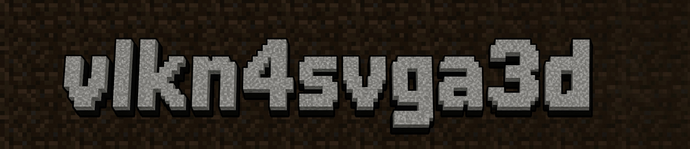

<p align="center">
  
</p>

# vlkn4svga3d

Experimental SVGA3D-to-Vulkan rendering library and QEMU integration prototype. Internal APIs still use `svga3_vlkn`.

The renderer handles a subset of legacy D3D9-style commands and shaders. Shader, format and guest compatibility remain incomplete. DX context lifecycle bookkeeping is isolated from legacy contexts; DX rendering is unsupported and no DX capability is advertised.

VM119 runs Debian with Mesa 22.3.6 and exposes OpenGL 2.1 through SVGA3D. The October 3–4 Piglit accuracy comparison completed all 146 cases: SVGA passed 85, failed 49, skipped five and timed out seven; llvmpipe passed all 146. Twenty-one former failures now pass, and all 64 previous passes remain passing. Five GPU hangs required VM recovery between cases. See [validation evidence](VALIDATION.md) for the method and limits.

## Build

Requires a C++17 compiler, GNU Make, binutils, pthreads and libdl. Vulkan headers are bundled. Real rendering needs the Vulkan loader and a working driver. Tests that request validation also need the validation layer. Mesa lavapipe works for host tests.

```sh
sudo apt install build-essential libvulkan1 mesa-vulkan-drivers vulkan-tools vulkan-validationlayers spirv-tools
make -j4 all
```

Core consumers link `lib/libsvga3_vlkn.a` with `-ldl -pthread`. The QEMU device harness additionally links `lib/libsvga3_qemu_adapter.a` before the core archive. Public interfaces are in `include/svga3_vlkn.h` and `include/qemu_vmsvga.h`; internal headers are not a stable API.

## QEMU lab adapter

Build the binary-patch adapter explicitly with `make preload-lab`. It is excluded from `make all`. It targets one allowlisted QEMU build and checks instruction bytes before patching. A build-ID mismatch exits with code 78 before patching and logs the observed ID. Use it only for the designated VM; never configure global `LD_PRELOAD`.

`SVGA3_VLKN_VALIDATE=1` requests validation and `=0` disables it. Without an override, debug builds request validation and release builds (`NDEBUG`) do not. Initialization fails when requested validation cannot be activated. `SVGA3_VLKN_GUEST_PROFILE=playbook-portrait` enables portrait overrides. Guest-RAM discovery still uses a lab mapping heuristic. Official QEMU integration remains follow-up work.

Host integrations register RAM map/read/write and display-update callbacks through `svga3_vlkn_device_set_host_adapter`, replacing the former callback setters. The core copies the table; its opaque host state must remain valid until detached or device destruction. Callbacks run under core locks and must not reenter device APIs. Rendering, presentation copies and fence completion stay in the core.

## Tests

```sh
make test
make harness-loop HARNESS_ICD=/usr/share/vulkan/icd.d/lvp_icd.json
make test-piglit PIGLIT_ARGS="--ssh svga3d@10.0.0.144 --renderer compare --output artifacts/piglit-compare"
```

`make test` checks the mock backend and reference harness. `make harness-loop` exercises the host Vulkan path. Piglit runs inside the guest and compares SVGA pixels with llvmpipe. Neither `test-qemu` nor `test_qemu_integration` boots a guest.

The [testing guide](docs/testing.md) covers dependencies, individual targets, suite coverage, repeated harness runs and Piglit result handling. [VALIDATION.md](VALIDATION.md) records measured results and their limits.

## Licensing

VirtualBox-derived files carry GPL-2.0 notices; the license text is in [COPYING](COPYING). VMware protocol headers and bundled Khronos headers retain their own notices. No blanket license has been chosen for original project code.

Presentation supports the primary screen (ID 0 or invalid/legacy ID). Other screen IDs return an error. Source and scanout pixel widths must match; 16-to-32 and 32-to-16 presentation return unsupported-format rather than truncating pixels. Surface-to-screen blits scale with nearest-neighbor sampling and select the requested cube face. Preload GMRFB blits support framebuffer GMR with 32-bit pixels and 24-bit color depth; other configurations emit a rate-limited rejection log.
